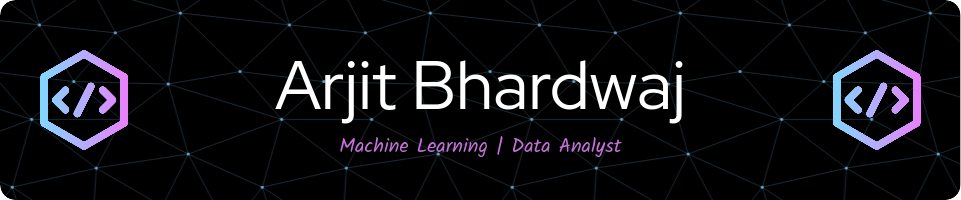

<body style="background-color:WhiteSmoke;">

<h1 align="center">

नमस्ते! (Namaste!)

</h1>

<b>👨‍💻 Tech Enthusiast | ML Passionate | Open Source Contributor | Committed to Problem Solving | Advocate for Research and Innovation in Modern Technology 🚀.</b>

  

 :star: Looking forward to have a successful professional career as a <b>Machine Learning Engineer</b> 

 :nerd_face: Currently working on <b>Improving Autonomous Navigation System with IIT Hyderabad</b> 

 :snowflake: Education: <b>B.E Computer Science and Engineering (Pursuing) at Dayananda Sagar College of Engineering, Bangalore</b> 

 🚀 Love to talk about <b>Artificial Intelligence, Machine Learning, Deep Learning, Research and Innovation!</b> 

 💻 Participated in different Open Source Programs as, a <b>Participant</b> 

 In short :beer:, I love to work on new technologies. :heart: 

 :sleeping: Fun Fact about me: I used to listen music during the time of coding! 

<h2>Testimonials 📝</h2>

|                                                                                 **Name**                                                                                  | **Thoughts on me!**                                                                                                                                                                                                                                                                                                                                                                                                                                                                                                                                                                                                                                                                                                                                                                                                                                                                                                                                                                                      |
|:------------------------------------------:|----------------------------|
|     [**Naveen Kumar K**](https://www.linkedin.com/in/naveen-kumar-k-a035a2129/)     | I wholeheartedly endorse Mr. Arjit Bhardwaj for his unwavering dedication and exceptional performance during the internship. His rapid learning and proactive adaptability are truly commendable. Arjit consistently embraced tasks with enthusiasm, demonstrating a sincere commitment to excellence. I confidently recommend him for any future endeavors, as his qualities make him an asset to any team or project. |
|    [**Dr.D.R.Ramesh Babu**](https://www.linkedin.com/in/dr-d-r-ramesh-babu-865b7b1a/)   | Arjit is a person who has the clarity about his ambitions. As a mentor and advisor, I have seen the evolution of his thinking process and problem solving skills. He has got a unique ability of focusing on the core skills, that are required to be an excellent data scientist. Moreover, he is a good team player and has got tremendous leadership skills to lead a team of enthusiastic people. 

## Connect with me

## 💻 OS [🔝](#welcome-badges-4-readmemd-profile)

## 🚀 Skills [🔝](#welcome-badges-4-readmemd-profile)

### :heavy_check_mark: Wanted to know more about me, Visit  :100:

## 💻 Workspace Spec [🔝](#welcome-badges-4-readmemd-profile)

 

**Visitors Count**

 

## Examples of my work

  
  
  
  

